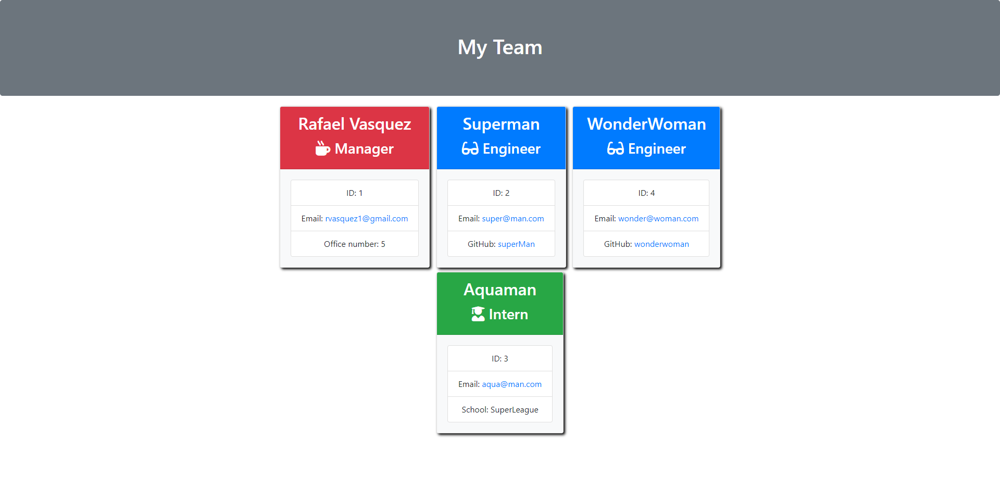

# Employee Summary - Team Generator

## Task

Build a software engineering team generator command line application. The application will prompt the user for information about the team manager and then information about the team members. The user can input any number of team members, and they may be a mix of engineers and interns. 

When the user has completed building the team, the application will create an HTML file that displays a nicely formatted team roster based on the information provided by the user.

The application will be invoked by using the following command:

```bash
node app.js
```
  ## Table of Contents

  1. [User Story](#user-story)
  2. [Built With](#built-with)
  3. [How to Use](#how-to-use)
  4. [Submission](#submission)
  5. [Example](#example)
  6. [Questions](#questions)

## User Story

```
As a manager
I want to generate a webpage that displays my team's basic info
so that I have quick access to emails and GitHub profiles
```
### Built With
----
```
  * Node.js
  * Javascript
  * Html
  * Test.js
  * Node Modules
    - inquirer (for prompt questions)
    - validator (for some validation)
    - jest (for tests)
```    

### How to Use
----
```
  1- Type "node app.js" in the console.
  2- Create Manager - Respond the questions that are going to appear in the console.
  3- More employees? No Problem.. Just answer Yes for more employees
  4- Question for more employees - Intern or Engineer
  5- Ask the right question for the role
  6- If you hit no more Employees...
  4- Watch the magic happends. Cards in the html file created with your employee answers.
  5- If you click in the table of content its going to take you to the right section.
  6- Open the file and see your new team.html
```    
### Submission
---

Github Repo URL: 
[https://github.com/v1zconde/employee_summary](https://github.com/v1zconde/employee_summary)

Deployed: 
[https://v1zconde.github.io/employee_summary/](https://v1zconde.github.io/employee_summary/)

How to use Video: 
[Watch Video](https://drive.google.com/file/d/16DR1gI9lLnXbwaZe1R0GafJ7x4BkabW-/view)


## Example
---
### Employee Summary



  ## Questions
you have any questions about the repo, open an issue or contact me directly at rvasquez1@gmail.com. You can find more of my work at 
  Github: [v1zconde](http://github.com/v1zconde)

